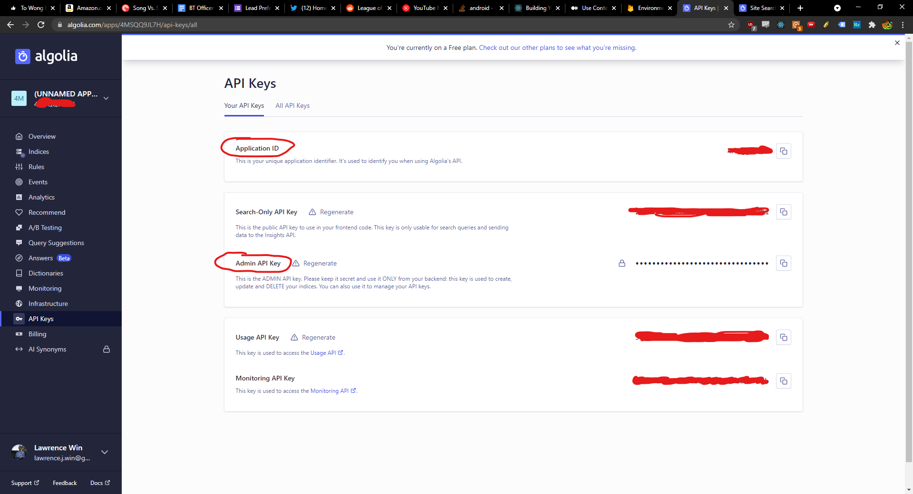

# Convergent Messaging Functions

This folder contains the cloud functions to deploy for the project, if you're setting this repo up locally.

## Setup

There are two sets of dependencies you will need to deploy your cloud functions to your firebase project: the global firebase CLI and the local project dependencies.

### Global Firebase CLI

To install the global firebase CLI, make sure you have a Javascript package manager installed, either `npm` or `yarn`. To check if you have either installed, type `npm -v` or `yarn -v` in your terminal and press enter. If successful, you should see the installed package manager's version number in your terminal window, otherwise you'll see an error. With your given package manager, run either of the following commands:

#### `npm install -g firebase-tools` for NPM users
#### `yarn global add firebase-tools` for Yarn users

After you have `firebase-tools` installed, you'll need to authenticate the CLI to work with your firebase project with it. If you haven't created a firebase project, look at the [root README.md](../README.md) for information.

1. In your terminal, run `firebase login`. This will open a browser window prompting for your Google login. Login to the account you're using for your firebase project.
2. You should be authenticated. Now, get your project-id, and navigate to the [.firebaserc](../.firebaserc) file at the root of this project. insert your project-id as the value of the `default` key.
```
{
  "projects": {
    "default": "<insert your firebase project id here>"
  }
}
``` 

### Local Dependencies

To install local dependencies, run one of the following commands depending on your package manager:

#### `npm install` for NPM users
#### `yarn install` for Yarn users

### Firebase Project Setup

Before you can deploy your cloud functions, you'll need to make adjustments to your project's billing. Cloud Functions is a pay-per-use serverless solution: you're billed based off of how many times your functions run. For functions running < 10,000 times, your bill will be minimal, and if this is your first time interacting with Google's developer services, then you will get free credits. However, if you're not comfortable paying, then you can stop now and ignore this part of the project. 

1. Go to your firebase project dashboard. In the bottom sidebar corner, check your plan. If you're on the **Blaze** plan, you've already upgraded your billing. If you're on the **Spark** plan, you'll need to switch to blaze. Click on the upgrade link on the right of your plan.  


2. Select the Blaze billing plan. On the next screen, click purchase.


3. If you've set up a previous billing account with Google's developer services, you can end here. Otherwise, you'll create on now. Select the country you're based in, enter your payment information, and confirm payment. 

4. *Optional, but highly recommended for broke college students:* With billing set up, you can set up a budget alert if your cloud functions usage really goes up. After you've upgraded, you should be greeted with a budget alert modal. Enter your money limit and click "Set budget alert".


### Algolia Setup

If you've set up an algolia project, you will need your API Key and App ID to use the admin client. The cloud functions in this project pull these values from their cloud environment configuration, which you will need to set.

Run the following command, inserting your own API Key and App ID where asked:

#### `firebase functions:config:set algolia.appid="<YOUR APP ID HERE>"  algolia.apikey="<YOUR ADMIN API KEY HERE>"`

You can find these values in your algolia dashboard. In the dashboard sidebar, click the API Keys section to navigate to your keys. There, make note of your Application ID and Admin API Key.



## Deploying Functions

To deploy functions to your project, run the following in the functions directory:

#### `firebase deploy --only functions`

This will take a little bit of time, but within minutes, you will have a working serverless backend!

## What Next

To wrap your head around the project, I've created a slide deck which gives an overview of Convergent Messenger as well as an overview of the cloud functions themselves.

You can also view the code for comments, and you can view some good general resources on firebase / cloud functions below.